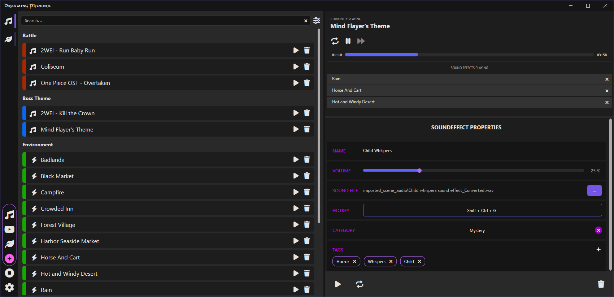

<!--
*** Thanks for checking out the Best-README-Template. If you have a suggestion
*** that would make this better, please fork the repo and create a pull request
*** or simply open an issue with the tag "enhancement".
*** Don't forget to give the project a star!
*** Thanks again! Now go create something AMAZING! :D
-->

<!-- PROJECT LOGO -->
 

  

  <h3 align="center">Dreaming Phoenix</h3>

  

    An open source soundboard for playing music and sound effects in real time!
     

    <a href="https://github.com/WizHat-Studios/dreaming-phoenix/releases/latest">Download Latest Release</a>
    ·
    <a href="https://github.com/WizHat-Studios/dreaming-phoenix/issues">Report Bug</a>
    ·
    <a href="https://github.com/WizHat-Studios/dreaming-phoenix/issues">Request Feature</a>
  

# About This Project

  

Dreaming Phoenix is a soundboard designed for playing music tracks and sound effects simultaneously. The original idea was that it should be used by game and dungeon masters in tabletop role-playing games like Dungeons & Dragons or Pathfinder. Despite this idea, it is not limited to these use cases and can therefore be used in a variety of other ways.

Currently the following features are supported:

* Add custom music tracks and sound effects (.wav, .aiff, .mp3, .wma and .aac files)
* Play a music track and sound effects simultaneously
* Fading between music tracks while playing
* Configurable global hotkeys for each music track and sound effect
* Choose from four different themes
* Add Scenes to switch between a collection of sounds instantly

## Getting Started
### Prerequisites
* [.NET Core 8.0 Runtime](https://dotnet.microsoft.com/en-us/download/dotnet/8.0) installed
### Installation

1. Download the [latest release](https://github.com/WizHat-Studios/dreaming-phoenix/releases/latest) from the release page.
2. Extract the downloaded `.zip` file to a directory of your choice.
3. Start the `WizHat.DreamingPhoenix.exe` in the directory.
4. Optionally add a shortcut to your desktop.
5. Profit.

## Tips & Tricks

### Adding Audio
If you add audio which is contained in the base- or subfolder of the `WizHat.DreamingPhoenix.exe` file, the program will still be able to find your audio when the location of the program has changed.

### Categories
If you give your audio file a category, it will be marked by a specific color. Use these colors to quickly determine at what kind of audio you're looking at.

## License

This project is distributed under the GPL-3.0 License. See the [LICENSE](./LICENSE) file for more information.

## Changelog

See the [CHANGELOG](./CHANGELOG.md) file for more information.

## Acknowledgments
This project has been made possible with the help of the following resources and people.

* [Font Awesome](https://fontawesome.com/)
* [Font Awesome WPF](https://github.com/DSaladinCH/fontawesome-wpf)
* [Alexander C. (talehuntdesign)](https://de.fiverr.com/freelancers/talehuntdesign)
* [Transitionz](https://github.com/ABTSoftware/SciChart.Wpf.UI)
* [NAudio](https://github.com/naudio/NAudio)
* [Newtonsoft Json](https://www.newtonsoft.com/json)
